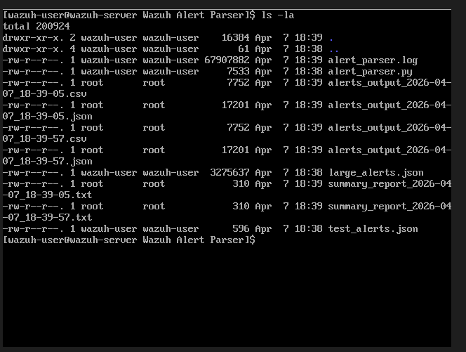

# 🔍 Wazuh Alert Parser & Exporter

Built to solve a real triage problem — parsing and normalizing Wazuh alerts in under 5 seconds to reduce manual analyst review time.

A lightweight Python tool for SOC analysts to parse Wazuh's `alerts.json`, filter by rule ID, enrich with MITRE ATT&CK mapping, and export clean, shareable data in JSON, CSV, and text-summary formats.

---

## Why I Built This

Manual alert review in Wazuh is slow when you're dealing with high-volume logs. This tool cuts triage time by filtering noise, mapping MITRE techniques automatically, and exporting clean data an analyst can actually work with.

---

## ✅ Features

- **Rule ID filtering** (configurable via CLI)
- **MITRE technique mapping** → human-readable names
- **Source IP**, **Process** & **Parent Process** extraction
- **Timestamped** export filenames for traceability
- **CLI** + **ANSI-colored** terminal output
- **Clean logging** to `alert_parser.log`
- **Exports**:
  - JSON (`alerts_output_<stamp>.json`)
  - CSV (`alerts_output_<stamp>.csv`)
  - Text summary (`summary_report_<stamp>.txt`)

---

## 📸 Screenshots

### Terminal Output


### Output Files Created


### Summary Report


---

## ⚙️ How to Use

### 1. Requirements

- Python 3.7+
- No external packages required (standard library only)
- Run on your Wazuh Manager where `alerts.json` lives

### 2. Clone the repo
```bash
git clone https://github.com/HoundOps/wazuh-alert-parser.git
cd wazuh-alert-parser
```

### 3. Default run
```bash
sudo python3 alert_parser.py
```

Reads `/var/ossec/logs/alerts/alerts.json` and exports timestamped output files to the current directory.

### 4. Custom options
```bash
sudo python3 alert_parser.py \
  --logpath ./test_alerts.json \
  --jsonout report.json \
  --csvout report.csv \
  --rules 60107 61601 530
```

---

## 🛠️ CLI Options

| Flag | Description | Default |
|------|-------------|---------|
| `--logpath` | Path to the Wazuh alerts.json file | `/var/ossec/logs/alerts/alerts.json` |
| `--jsonout` | Output JSON filename | `alerts_output_<stamp>.json` |
| `--csvout` | Output CSV filename | `alerts_output_<stamp>.csv` |
| `--rules` | Space-separated rule IDs to filter | `60107 60106 61601 61603 67027 530 533 18107` |

---

## 📂 Output Files

**JSON** — structured alert data with parse metadata:
```json
{
  "parse_time": "2026-04-07T18:39:57",
  "total_alerts": 68,
  "filtered_rules": ["60107", "533", ...],
  "alerts": [...]
}
```

**CSV** — one row per alert including parse_time column

**Summary report** — human-readable breakdown:
```
Parse Time: 2026-04-07T18:39:57
Total Alerts Processed: 68

=== Alert Rule Frequency Summary ===
Rule 533 – Listened ports status changed (7 alerts)
Rule 60106 – Windows Logon Success (61 alerts)

=== MITRE Technique Summary ===
N/A: 7 alerts
T1078: 61 alerts
```

## 🧠 MITRE Mapping

Alerts with `rule.mitre.id` are mapped to readable technique names:

| MITRE ID | Description |
|----------|-------------|
| T1059.001 | PowerShell |
| T1047 | WMI |
| T1021.001 | Remote Desktop Protocol |

Expand the `mitre_mapping` dictionary in the script to add more.

---

## 🧪 Testing

A `test_alerts.json` and `large_alerts.json` are included for local testing without a live Wazuh instance:
```bash
python3 alert_parser.py --logpath test_alerts.json
```

---

## 📜 License

MIT — free to use, modify, and adapt.
